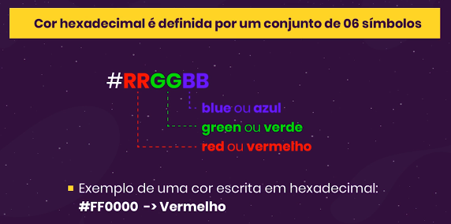

# Front End 📘 HTML, CSS e JS 📘 !

>  Relembrando e aprendendo conceitos de front-end
> Além  de treino, este repositório serve também como um compilado de documentação e um mapa mental pessoal sobre programação web.  Para mais projetos confira [esta página](https://github.com/jonasaacampos).

## Table of Contents

1. [HTML5 - "*puro*"](#html-5)
2. [CSS](#css)
3. [Java Script](#java-script)

---


### HTML 5

<details>
<summary><strong>Elementos da página</strong></summary>

> Clique para acessar a documentação

- [Block and Inline Elements](https://www.w3schools.com/html/html_blocks.asp)
- [Tables](https://www.w3schools.com/html/html_tables.asp)
- [Forms](https://www.w3schools.com/html/html_forms.asp)

</details>

<details>
<summary><strong>Elementos Semânticos</strong></summary>

> Marcações para melhorar a leitura do código.

<p align="center">

</p>

```
      <article>
      <aside>
      <details>
      <figcaption>
      <figure>
      <footer>
      <header>
      <main>
      <mark>
      <nav>
      <section>
      <summary>
      <time>
```

>  Clique para acessar a documentação
- [Semantic Elements](https://www.w3schools.com/html/html5_semantic_elements.asp)

</details>

<details>
<summary><strong>Audio e Video</strong></summary>

- [Tag de vídeo HTML5:](https://www.w3schools.com/html/html5_video.asp)
- [Tag de áudio HTML5:](https://www.w3schools.com/html/html5_audio.asp)
- [Lista de novas Tags:](https://www.w3schools.com/html/html5_new_elements.asp)
- [Semantica no HTML 5:](https://www.w3schools.com/html/html5_semantic_elements.asp)
- [Documentação dos tipos de input:](https://www.w3schools.com/html/html_form_input_types.asp)
- [Simulando os tipos novos de input:](https://www.webfx.com/blog/images/assets/cdn.sixrevisions.com/demos/0345-new_html5_form_input_types/new-html5-form-input-types.html)

</details>

> [🏠 Voltar para índice](#table-of-contents)

---


### CSS
<details>
<summary><strong>Princípio Geral</strong></summary>

- [Referência de CSS](https://developer.mozilla.org/pt-BR/docs/Web/CSS/Reference)

**Anatomia de um conjunto de regras CSS**


**Seletor (Selector)**

O nome do elemento HTML no começo do conjunto de regras. Ele seleciona o(s) elemento(s) a serem estilizados (nesse caso, elementos ```<p>```). Para dar estilo a um outro elemento, é só mudar o seletor.

**Declaração (Declaration)**

Uma regra simples como color: red; especificando quais das propriedades do elemento você quer estilizar.

**Propriedades (Property)**

Forma pela qual você estiliza um elemento HTML. (Nesse caso, color é uma propriedade dos elementos ```<p>```.) Em CSS, você escolhe quais propriedades você deseja afetar com sua regra.

**Valor da propriedade (Property value)**

À direita da propriedade, depois dos dois pontos, nós temos o valor de propriedade, que escolhe uma dentre muitas aparências possíveis para uma determinada propriedade (há muitos valores color(cor) além do red(vermelho)).

Note outras partes importantes da sintaxe:
- Cada linha de comando deve ser envolvida em chaves ({}).
- Dentro de cada declaração, você deve usar dois pontos (:) para separar a propriedade de seus valores.
- Dentro de cada conjunto de regras, você deve usar um ponto e vírgula (;) para separar cada declaração da próxima.

Então para modificar múltiplos valores de propriedades de uma vez, você deve escrevê-los separados por ponto e vírgula, desse modo:

**Modificar múltiplas propriedades**

```p {
  color: red;
  width: 500px;
  border: 1px solid black;
}
```

**Selecionar múltiplos elementos**

```p, li, h1 {
  color: red;
}
```

</details>

<details>
<summary><strong>Cores</strong></summary>

Para definir cores no css, podemos usar
- nome
- valor RGB
- Valor Hexadecimal
- Valor HSL (css3)
- Valor HWB (css4)

O mais utilizado hoje em dia é o hexadecimal



</details>

<details>
<summary><strong>Seletores em CSS</strong></summary>

> A Mozilla possui uma tabela com todos os seletores. [Reference table of selectors](https://developer.mozilla.org/en-US/docs/Learn/CSS/Building_blocks/Selectors#reference_table_of_selectors).

<table class="standard-table">
<caption><h3>Principais seletores</h3></caption>
 <thead>
  <tr>
   <th scope="col">Nome do seletor</th>
   <th scope="col">O que ele seleciona</th>
   <th scope="col">Exemplo</th>
  </tr>
 </thead>
 <tbody>
  <tr>
   <td>Seletor de elemento (às vezes, chamado tag ou seletor de tipo)</td>
   <td>Todos os elementos HTML de determinado tipo.</td>
   <td><code>p</code><br>
    Seleciona <code>&lt;p&gt;</code></td>
  </tr>
  <tr>
   <td>Seletor de ID</td>
   <td>O elemento na página com o ID específicado. Em uma determinada página HTML, é uma boa prática usar um elemento por ID (e claro, um ID por elemento) mesmo que seja permitido usar o mesmo ID para vários elementos.</td>
   <td><code>#my-id</code><br>
    Seleciona <code>&lt;p id="my-id"&gt;</code> ou <code>&lt;a id="my-id"&gt;</code></td>
  </tr>
  <tr>
   <td>Seletor de classe</td>
   <td>O(s) elemento(s) na página com a classe específicada (várias instâncias de classe podem aparecer em uma página).</td>
   <td><code>.my-class</code><br>
    Seleciona <code>&lt;p class="my-class"&gt;</code> e <code>&lt;a class="my-class"&gt;</code></td>
  </tr>
  <tr>
   <td>Seletor de atributo</td>
   <td>O(s) elemento(s) na página com o atributo especificado.</td>
   <td><code>img[src]</code><br>
    Seleciona <code>&lt;img src="myimage.png"&gt;</code> mas não <code>&lt;img&gt;</code></td>
  </tr>
  <tr>
   <td>Seletor de pseudo-classe</td>
   <td>O(s) elemento(s) específicado(s), mas somente quando estiver no estado especificado. Ex.: com o mouse sobre ele.</td>
   <td><code>a:hover</code><br>
    Seleciona <code>&lt;a&gt;</code>, mas somente quando o mouse está em cima do link.</td>
  </tr>
 </tbody>
</table>

</details>

<details>
<summary>Fontes</summary>

> Recomendado utilizar fontes online ao invés de fontes disponíneis no navegador do usuário. Use o [Google fonts](https://fonts.google.com/).

**Famílias de fontes genéricas**

Em CSS existem cinco famílias de fontes genéricas:

1. As **fontes com serifa** têm um pequeno traço nas bordas de cada letra. Eles criam uma sensação de formalidade e elegância.
2. As **fontes sem serifa** têm linhas limpas (sem pequenos traços anexados). Eles criam um visual moderno e minimalista.
3. **Fontes monoespaçadas** - aqui todas as letras têm a mesma largura fixa. Eles criam uma aparência mecânica.
4. As **fontes cursivas** imitam a caligrafia humana.
5. **Fontes de fantasia** são fontes decorativas/lúdicas.

*Todos os nomes de fontes diferentes pertencem a uma das famílias de fontes genéricas.*

</details>

<details>
<summary>O modelo de caixa CSS (Box Model)</summary>

Em CSS, o termo "modelo de caixa" é usado quando se fala de design e layout.

O modelo de caixa CSS é essencialmente uma caixa que envolve cada elemento HTML. Ele consiste em: margens, bordas, preenchimento e o conteúdo real. A imagem abaixo ilustra o modelo da caixa:


- **Content** é o conteúdo da caixa, onde o texto e as imagens aparecem
- **Padding**  Limpa uma área ao redor do conteúdo. O forro é transparente
- **Border**  Uma borda que contorna o preenchimento e o conteúdo
- **Margin**  Limpa uma área fora da fronteira. A margem é transparente

</details>

<details>
<summary>Bulma</summary>

> Framework do css para econimizar trabalho. Acesse [Bulma](https://bulma.io/)
> É possível baixar do cdn tambem [bulma](https://cdnjs.com/libraries/bulma)

Ao invés de inserir o arquivo css no diretório do nosso site, podemos usar o **arquivo disponível no CDN.**

https://cdnjs.com/libraries/font-awesome

inserir como link e como script

` https://cdnjs.cloudflare.com/ajax/libs/bulma/0.9.3/css/bulma.min.css`

`https://cdnjs.cloudflare.com/ajax/libs/font-awesome/6.0.0/js/all.min.js`

**Componentes**

Podemos baixar componentes elegantes e pré configurados nos componentes do bulma 
https://bulma.io/documentation/components/
</details>

---

[//]: # ()


## Java Script

<details>
<summary>Declaração de Variáveis</summary>

- `let` para declarar variáveis
- `const` declara variáveis que não podem ser mudadas (constantes)
- `var` igual à let, utilizada em versões anteriores
</details>

<details>
<summary>Interagindo com o usuário</summary>

- `console.log || console.info` registra no console informações
- `prompt` - pede informações de texto para usuário
- `confirm` - confirma dados e gera um valor lógico
- `alert` - exibe um popup de alerta
</details>

<details>
<summary><strong>Condicionais (IF | SWITCH CASE)</strong></summary>

Síntaxe: 
``` 
if(condicao){
    bloco de código...
}else if (condição) {
    bloco de código...
}else {
    bloco de código...
}
``` 
*Pode-se* utilizar do operador ternário caso a condição possua poucas linhas

**Mas os blocos condicinais são mais legíveis.**

```
switch (variavel) {
    case x:
    case y:
    ...
    case z:
        bloco de código...
        break
    default
        bloco de código...
        break
}
```

</details>

<details>
<summary><strong>Loops</strong></summary>

Repete um bloco de código N vezes ou até que uma condição seja atendida

```
while (condição){
    bloco de código...
}
```

Enquanto o while recebe uma única expressão, no `for` podemos adicionar variáveis para conrolar as iterecações

```
for (variável,  expressão, ação de controle){
    bloco de código...
}
```

```
do {
    bloco de código
} wilhe(condiçao)
```
</details>

<details>
<summary><strong>Funções</strong></summary>

Função é um bloco de código **nomeado** que executa uma determinada ação, e podemos utilizar este bloco a qualquer momento

```
function algumaTarefa() {
    bloco de código
}
```

Para chamar uma função, basta escrever:
`algumaTarefa()`

Funções com valores padrão

```
function cumprimentarUsuario(name, message = "Oi") {
    alert(message + name + "!")
}
```
Resultados ao chamar a função:

```
cumprimentarUsuario("Jonas")
// Oi Jonas!

cumprimentarUsuario("Jonas", "Seja bem vindo!")
// Seja Bem vindo Jonas!

```
**BOA PRÁTICA**
_Utilize variáveis com valores padrão sempre como último parâmetro da função_
</details>

<details>
<summary><strong>Escopo</strong></summary>
 - Variáveis declaradas com `let` fora da estrutra do bloco, possui escopo global
 - Caso a variável seja declarada dentro do bloco, ela possui escopo local
 - declarar variaveis com `var`, faz com que esta possua um nivel maior do que a do escopo atual

</details>

<details>
<summary><strong>Funções Anônimas</strong></summary>

São funções que não possuem nome, que são adicionadas dentro de variáveis

```
let doubleSpeed = function(velocity) {
    return velocity * 2
}


let newVelocity  = doubleSpeed(40)

console.log(newVelocity)
// 80

```

**Importante**

- Funções tradicionais são lidas sempre primeiro, mesmo que esteja no final do código
- Funçẽos anônimas seguem a ordem de execução do código

</details>

<details>
<summary><strong>Arrow Functions</strong></summary>

São também **funções anônimas**. São funções reduzidas.

```
const doubleVelocity = () => {

}


const doubleVelocity = (parametro) => {

}

```

Para funções com apenas uma linha, podemos escrever:

```
const doubleVelocity  = (velocity) => velocity * 2

/* Chamando a função*/

conlose.log(doubleVelocity(60))
//120
```
</details>

<details>
<summary><font color="red" ><strong>Funções de Alta Classe</strong> (High Order Functions)</font></summary>

- São funções que recebem e retorna outras funções
- Quando uma HOF recebe uma função, _geralmente_ são funções anônimas (ou arrows functions)
- A função enviada como parâmentro de uma HOF é denominada de **callback**

```
//função tradicionas
function doubleVelocity(velocity, printer) {
    console.log("acessei a função...")
    let newVelocity = velecity * 2
    printer(newVelocity)
    return newVelocity
}

//funçao anonima (arrow function)
let printVelocity =  velocity => {
    console.log("Nova velociadade: " + velocity + "Km/s.")
}

//funçao anonima
let newVelocity = doubleVelocity(60, printVelocity)

console.log(newVelocity)
    /*output...*/
// "acessei a função..."
// "Nova velociadade: 120 Km/s."
// 120

```
Um outro exemplo de HOF

```
function doubleVelocity(velocity, printer) {
    console.log("acessei a função...")
    let newVelocity = velecity * 2
    printer(newVelocity)
    return newVelocity
}

let anotherVelocity = doubleVelocity(50, velocity => {
console.log("Outra velocidade é de: " + velocity)  
}

    /*output...*/
// "acessei a função..."
// "Outra velocidade é de: 100"


```


</details>

## Crédito das imagens
As logomarcas (no título de cada seção) são do [FlatIcon](https://www.flaticon.com/br/).